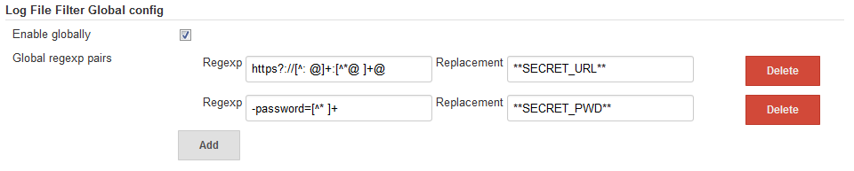
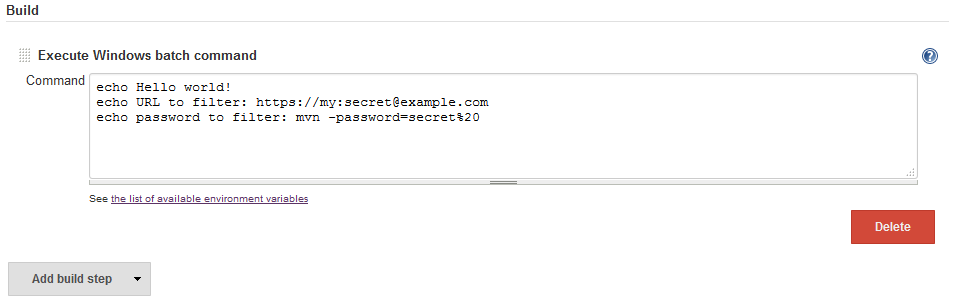
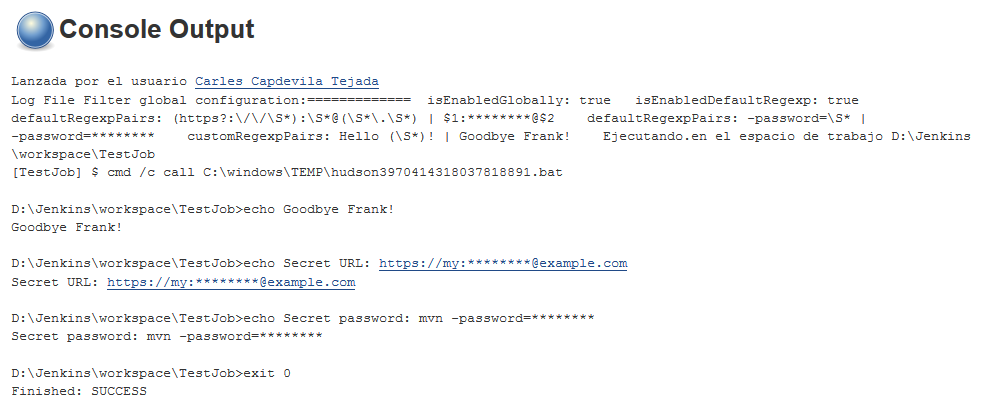

Jenkins Log File Filter Plugin
===============================

This plugin allows filtering Jenkins' console output by means of regular expressions. Some expressions are included by default; to see which are the default expressions go to the Jenkins global settings and click the "Enable default regexp" help icon. They can be turned off by unchecking the "Enable default regexp" checkbox.

To define a custom filter, go to the Jenkins global settings and add a new entry in the "Custom regexp pairs" setting. The regexes follow the conventions explained in [the Java "Pattern" class](https://docs.oracle.com/javase/8/docs/api/java/util/regex/Pattern.html#sum).

To disable the filtering, just uncheck the "Enable globally" checkbox in the global settings. Note that not even the default regexp will work.

# Configuring the plugin

Note that the filtering is applied to all projects.




 



# Pipeline usage

To enable the log file filter inside a pipeline, simply surround the code with the logFileFilter call:

```groovy
...
logFileFilter {
    ...
  echo 'This is a filtered SECRET'
    ...
}
echo 'Log file filter is not active here SECRET'
...
```
